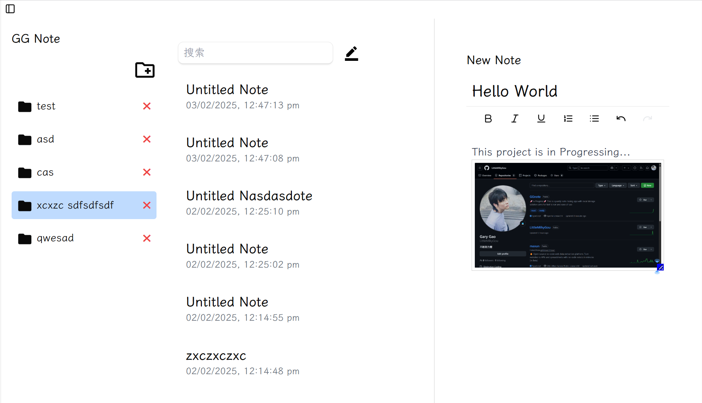

# ⭐Features
1. Fast loading by local storage solution — no cloud database required.
2. Design for ease of use — no fancy functionalites
3. Will utilize Tauri for building lightweight desktop application — less RAM usage 

## 💬Future Functionalites
- [x] Electron integration for packaging app
- [x] Rich text editor
- [ ] Drag to Reorder & Set Top Button
- [ ] Switch Workplace
- [ ] Global searching
- [ ] Dark mode
- [ ] Deleted notes into trash bin
- [ ] Storage path setting
- [ ] Diary Section (Different UI)
- [ ] Background Images setting (Not important)

## 🚀Prerequisites
Ensure you have the following installed on your system:

- [Node.js](https://nodejs.org/) (v15.x or later recommended)
- [npm](https://www.npmjs.com/) (v6.x or later) 

Additionally, for building and packaging the application, you will need:
- Windows: Visual Studio Build Tools

1. `npm install`
2. `npm run build`
3. `npm run start`

If success, you will see a popup window

## ⭐ Demo ⭐

